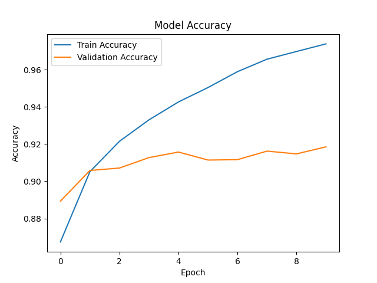
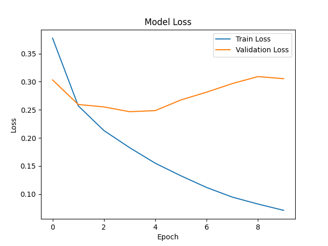
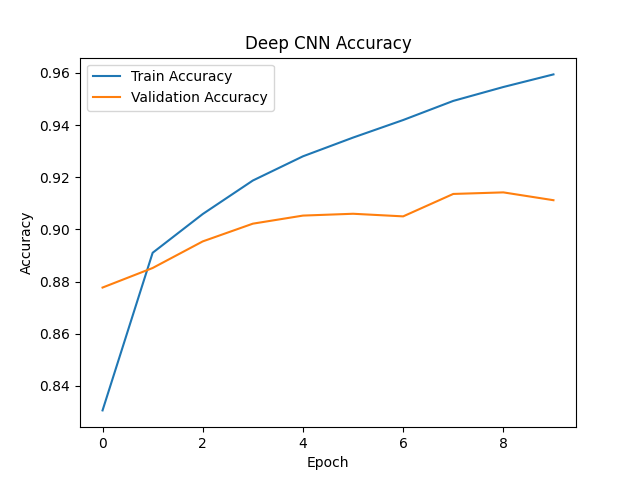
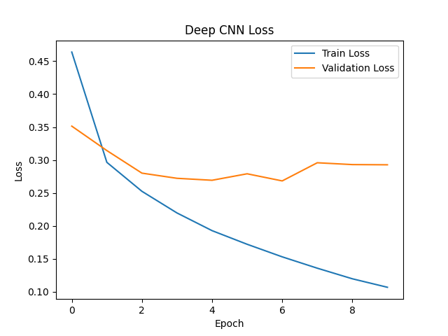
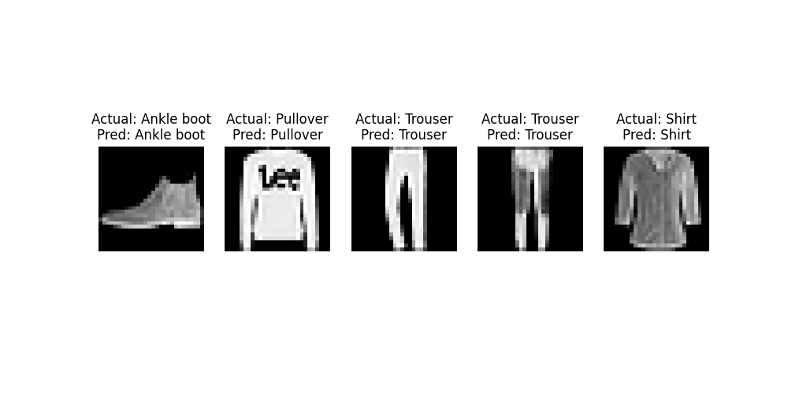
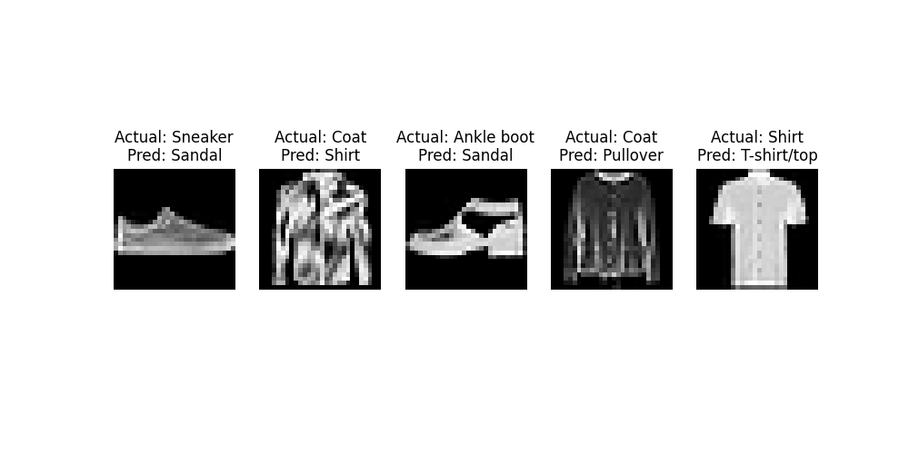
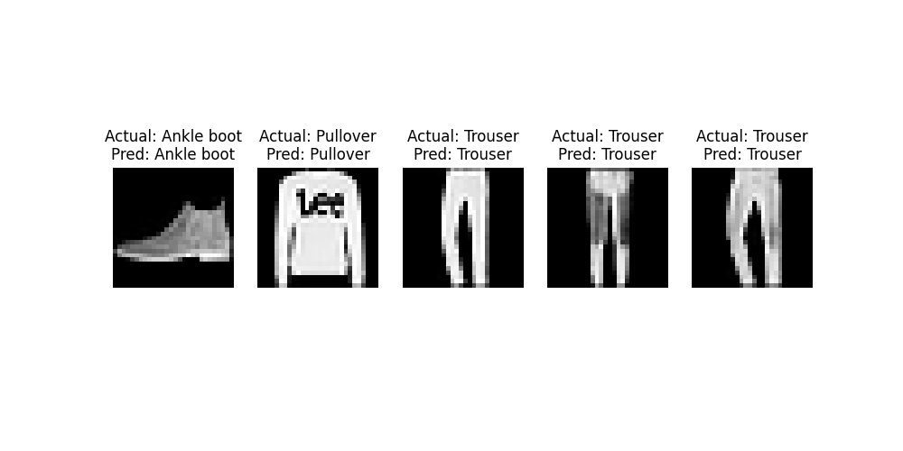
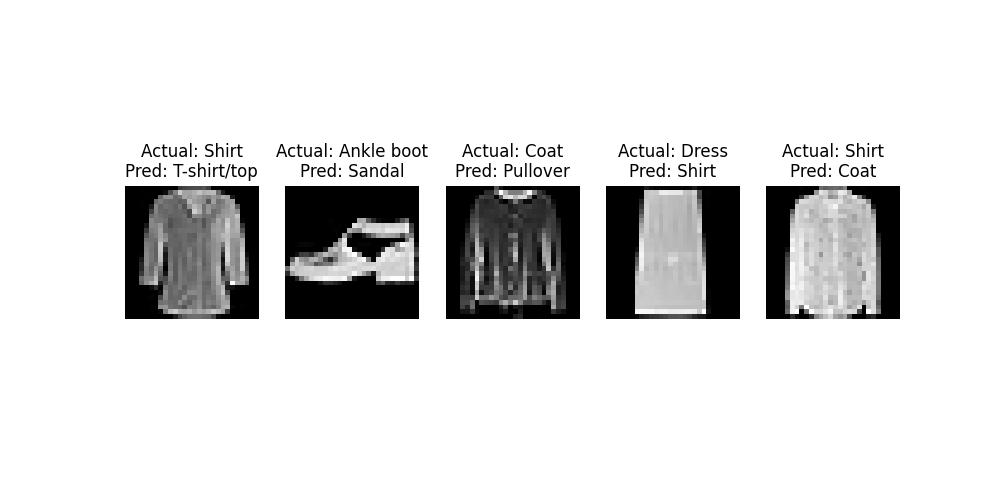
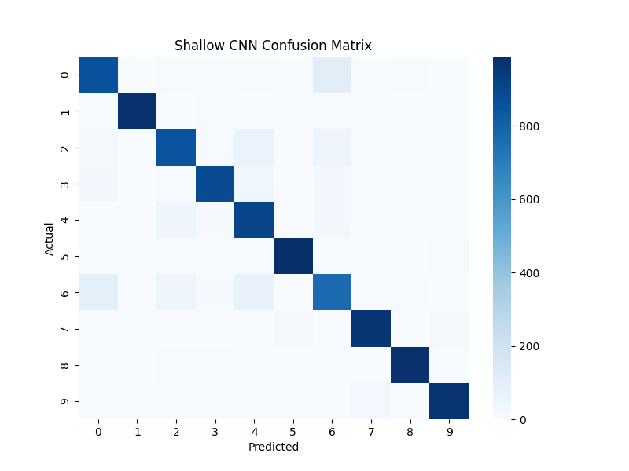
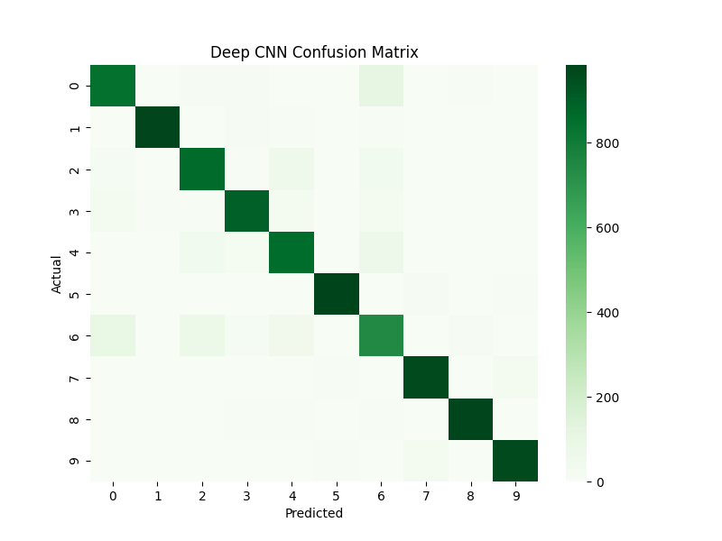

# 🧠 Shallow CNN vs Deep CNN on Fashion-MNIST

## 📌 Objective
👉 View full implementation: [Jupyter Notebook](cnn.ipynb)
This project compares the performance of a **Shallow CNN** and a **Deep CNN** on the Fashion-MNIST dataset.

The goal is to analyze:
- Accuracy
- Efficiency
- Generalization
- Model complexity

---

## 📊 Dataset
- 60,000 training images  
- 10,000 test images  
- 10 classes (fashion categories)  
- Image size: 28×28 grayscale  

---

## ⚙️ Models Used

### 🔹 Shallow CNN
- 1 Convolution Layer
- 1 MaxPooling Layer
- Dense Layer

### 🔹 Deep CNN
- 3 Convolution Layers
- 2 MaxPooling Layers
- Dense Layer

---

## 📈 Model Performance

### 🔹 Shallow CNN Accuracy

### 🔹 Shallow CNN Loss

### 🔹 Deep CNN Accuracy

### 🔹 Deep CNN Loss

---

## 🔍 Prediction Analysis

### ✅ Correct Predictions (Shallow CNN)

### ❌ Incorrect Predictions (Shallow CNN)

### ✅ Correct Predictions (Deep CNN)

### ❌ Incorrect Predictions (Deep CNN)

---

## 📊 Confusion Matrices

### 🔹 Shallow CNN

### 🔹 Deep CNN

---

## 📌 Key Insights

- Shallow CNN achieved **higher accuracy**
- Deep CNN was **more efficient (faster & fewer parameters)**
- Both models struggled with **similar-looking classes**
- Increasing depth did **not significantly improve performance**

---

## 🏁 Conclusion

- ✅ Recommended Model: **Shallow CNN**
- ⚡ Most Efficient: **Deep CNN**
- 🎯 Most Accurate: **Shallow CNN**

👉 Simpler models can outperform deeper ones on relatively simple datasets like Fashion-MNIST.
